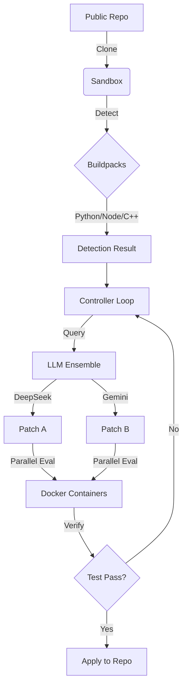

# 🚀 RFSN Controller "Ultimate Build"

> **Autonomous. Resilient. Polyglot.**
> The next-generation coding agent that fixes bugs across languages using a multi-model ensemble.

The **RFSN Controller** is an advanced autonomous repair agent designed to ingest GitHub repositories, detect bugs, and patch them without human intervention. This "Ultimate Build" introduces active-active model fallback, broad language support, and persistent active learning.

---

## 🔥 Key Features

### 🧠 active-active LLM Ensemble

Why rely on one model? The Controller can query multiple providers simultaneously.

- **DeepSeek V3**: Primary reasoning engine.
- **Gemini 2.0 Flash**: High-speed fallback and verifier.
- **Resilience**: If one API fails, the other takes over instantly. No downtime.
- **Consensus**: "Votes" on the best patch from multiple candidates.

### 🌐 Universal Polyglot Support

Detects, builds, and fixes projects in almost any language via modular **Buildpacks**:

- **Python**: `pyproject.toml`, `requirements.txt`, `setup.py`
- **Node.js**: `npm`, `yarn`, `pnpm` with active version management.
- **C / C++**: `CMake`, `Makefile`, and single-file `gcc` support.
- **Rust**, **Go**, **Java**, **.NET**: Native support included.

### ⚡ Active Learning Memory

The system gets smarter with every run.

- **Action Memory**: Remembers which tools fixed specific error types.
- **Outcome Database**: Stores success/failure rates in SQLite.
- **Contextual Bandits**: Uses Thompson Sampling to optimize strategy (e.g., "Search First" vs "Edit Immediately").

### 🏗️ Parallel Execution

- **Multi-Threaded**: Evaluates up to 3 candidate patches simultaneously in isolated Docker containers.
- **Fast Feedback**: Runs focused tests first, failing fast before full test suites.

---

## 🚀 Quick Start

### Prerequisites

- **Python 3.10+**
- **Docker** (running and accessible)
- **API Keys**: `DEEPSEEK_API_KEY`, `GEMINI_API_KEY` (optional for fallback)

### Installation

```bash
# Clone the repo
git clone https://github.com/dawsonblock/DRFSN-CODE.git
cd DRFSN-CODE

# Install dependencies (using uv for speed)
pip install -r requirements.txt
# OR
uv pip install -r requirements.txt
```

### Usage

Run the controller on any public GitHub repository:

```bash
python -m rfsn_controller.main \
  --github-url https://github.com/YourUser/YourRepo \
  --max-steps 20 \
  --ensemble-mode \
  --parallel-patches
```

### Configuration

Key flags to control behavior:

- `--ensemble-mode`: Enable multi-model querying.
- `--parallel-patches`: Evaluate patches in parallel threads.
- `--learning-db-path`: Path to SQLite DB for memory.
- `--buildpack auto`: Automatically detect project language (Default).

---

## 📂 Architecture



---

## 🛠️ Buildpacks

The system uses a modular `buildpacks/` directory to handle different languages:

| Language | Detector | Supported Tools |
|----------|----------|-----------------|
| **Python** | `python_pack.py` | pip, uv, pytest, nose |
| **C/C++** | `cpp_pack.py` | gcc, cmake, make, ctest |
| **Node.js** | `node_pack.py` | npm, yarn, pnpm, jest |
| **Go** | `go_pack.py` | go mod, go test |

---

## 📈 Dashboard

Monitor progress in real-time. The controller logs all actions, tool outputs, and model thoughts to `rfsn_dashboard/`.

---

**Built by Dawson Block & The Google DeepMind Team**
*Part of the RFSN Enterprise Project*
