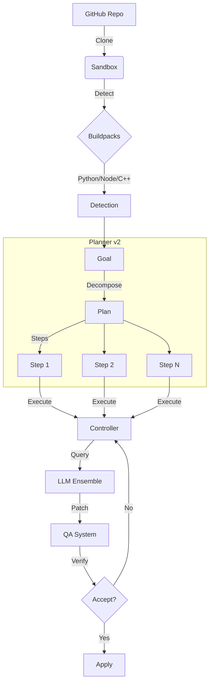

# 🚀 RFSN Controller "Ultimate Build"

> **Autonomous. Resilient. Polyglot.**
> The next-generation coding agent that fixes bugs across languages using a multi-model ensemble.

The **RFSN Controller** is an advanced autonomous repair agent designed to ingest GitHub repositories, detect bugs, and patch them without human intervention. This "Ultimate Build" introduces active-active model fallback, broad language support, a structured planner layer, and adversarial QA.

---

## 🔥 Key Features

### 🧠 Active-Active LLM Ensemble

Why rely on one model? The Controller can query multiple providers simultaneously.

- **DeepSeek V3**: Primary reasoning engine
- **Gemini 2.0 Flash**: High-speed fallback and verifier
- **Resilience**: If one API fails, the other takes over instantly
- **Consensus**: "Votes" on the best patch from multiple candidates

### 📋 Planner v2.2 (NEW)

High-level goal decomposition with governance, audit trails, and developer ergonomics.

```python
from rfsn_controller.planner_v2 import PlannerV2, ControllerAdapter

adapter = ControllerAdapter(planner)
task_spec = adapter.start_goal("Fix failing test", {"test_cmd": "pytest"})

while task_spec:
    outcome = controller.execute(task_spec)
    task_spec = adapter.process_outcome(outcome)
```

| Module | Description |
|--------|-------------|
| **PlannerV2** | Goal decomposition into atomic steps |
| **LLMDecomposer** | LLM-powered intelligent breakdown |
| **PlanValidator** | Validates forbidden paths, wildcards, prompt injection |
| **PlanBudget** | Resource caps (cycles, tokens, time) |
| **HaltChecker** | Stops on flaky streaks, file growth, stalls |
| **ParallelExecutor** | Concurrent independent step execution |
| **PlanCache** | Goal similarity caching for reuse |
| **MetricsCollector** | Prometheus-ready performance tracking |

### ⚖️ Adversarial QA System

Claim-based verification that treats every patch as "guilty until proven innocent."

| Claim Type | Description |
|------------|-------------|
| `FUNCTIONAL_FIX` | Patch fixes failing tests |
| `NO_REGRESSION` | Doesn't break passing tests |
| `SCOPE_MINIMALITY` | Change is minimal/targeted |
| `SAFETY_COMPLIANCE` | Respects allowed file boundaries |

- **QA Critic**: Challenges claims, demands evidence
- **Evidence Collector**: Gathers test results, delta maps, static analysis
- **QA Gate**: Accept/Reject/Escalate decisions

### 🌐 Universal Polyglot Support

Detects, builds, and fixes projects in almost any language via modular **Buildpacks**:

| Language | Detector | Supported Tools |
|----------|----------|-----------------|
| **Python** | `python_pack.py` | pip, uv, pytest, nose |
| **Node.js** | `node_pack.py` | npm, yarn, pnpm, jest |
| **C/C++** | `cpp_pack.py` | gcc, cmake, make, ctest |
| **Go** | `go_pack.py` | go mod, go test |
| **Rust** | `rust_pack.py` | cargo build, cargo test |
| **Java** | `java_pack.py` | maven, gradle |

### ⚡ Active Learning Memory

The system gets smarter with every run.

- **Action Memory**: Remembers which tools fixed specific error types
- **Outcome Database**: Stores success/failure rates in SQLite
- **Contextual Bandits**: Uses Thompson Sampling to optimize strategy

### 🏗️ Parallel Execution

- **Multi-Threaded**: Evaluates up to 3 candidate patches simultaneously in isolated Docker containers
- **Fast Feedback**: Runs focused tests first, failing fast before full test suites

---

## 🚀 Quick Start

### Prerequisites

- **Python 3.10+**
- **Docker** (running and accessible)
- **API Keys**: `DEEPSEEK_API_KEY`, `GEMINI_API_KEY` (optional)

### Installation

```bash
git clone https://github.com/dawsonblock/DRFSN-CODE.git
cd DRFSN-CODE
pip install -r requirements.txt
```

### Usage

```bash
# Standard repair mode
python -m rfsn_controller.main \
  --github-url https://github.com/YourUser/YourRepo \
  --max-steps 20 \
  --ensemble-mode

# With Planner v2 mode
python -m rfsn_controller.main \
  --github-url https://github.com/YourUser/YourRepo \
  --planner-mode v2 \
  --parallel-patches
```

---

## 📂 Architecture



---

## 📁 Project Structure

```
rfsn_controller/
├── controller.py       # Main controller loop
├── planner_v2/         # Planner layer (v2.2)
│   ├── planner.py      # Goal decomposition
│   ├── llm_decomposer.py
│   ├── governance/     # Validation, budgets, halts
│   ├── parallel_executor.py
│   ├── plan_cache.py
│   └── metrics.py
├── qa/                 # Adversarial QA system
│   ├── qa_orchestrator.py
│   ├── qa_critic.py
│   └── evidence_collector.py
├── buildpacks/         # Language detection
├── llm/                # Model providers
└── sandbox.py          # Isolated execution
```

---

## 📈 Metrics & Observability

The Planner tracks comprehensive metrics exportable to Prometheus:

```prometheus
planner_plans_total{source="llm"} 42
planner_plans_total{source="cache"} 15
planner_step_success_rate 0.85
planner_cache_hit_rate 0.26
planner_avg_plan_time_ms 123.45
```

---

## 🧪 Testing

```bash
# Run all tests
pytest tests/ -v

# Planner v2 tests
pytest tests/test_planner_v2.py tests/test_planner_v2_governance.py -v

# QA system tests
pytest tests/test_qa*.py -v
```

---

## 📜 License

MIT License - See [LICENSE](LICENSE) for details.

---

**Built by Dawson Block & The Google DeepMind Team**
*Part of the RFSN Enterprise Project*
